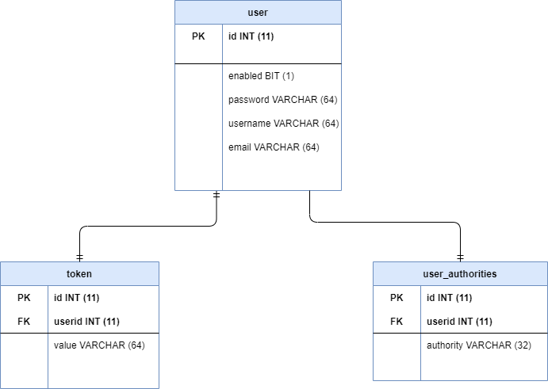

# Login Registration
Spring Security application. User is able to register and confirm e-mail, login, get access to application based on users roles. 
 see application videos: https://drive.google.com/drive/folders/1Clxn2RXyDLW2-Ydo2yaswtHWQYP4chNp?usp=sharing

<h2>Application description</h2>
Application – custom login, register panel has been created as result of getting to know Spring Security framework. 

<h3>Registration</h3>
User is able to register - for this purpose he must provide login, password and e-mail. If he left any field empty he will be informed via message.
If user provides login that already exists he will be informed via message. If he fills the form correctly he needs to confirm e-mail address. If he pass invalid token during the account activation he will be informed via message. If the activation is successful, the user will be informed about it – since then he is able to log in into the application.

<h3>Login</h3>
User is able to log in - for this purpose he must provide login, password. If given login and password do not match he will be informed via message. If he fills the form correctly he will be redirected to main dashboard of the application.

<h3>Main dashboard</h3>
Main dashboard is displayed only to logged in users. Every attempt to access dashboard by users who are not logged in will end up redirecting to login form. If user is in administration role he can get the access to resource only for admins. If user is not in administration role this attempt will end up showing custom forbidden access page (403).
Logged user can log out.

<h3>Technology</h3>
<ul>
  <li>Spring</li>
  <ul>
	<li>spring-boot-starter-data-jpa</li>
	<li>spring-boot-starter-mail</li>
	<li>spring-boot-starter-security</li>
	<li>spring-boot-starter-thymeleaf</li>
  <li>spring-boot-starter-web</li>
  </ul>
  <li>hibernate-validator</li>
  <li>Bootstrap</li>
</ul>
<h3>Database schema</h3>

# Logowanie Rejestracja
Aplikacja wykorzystująca Spring Security umożliwiająca rejestrację konta wraz z potwierdzeniem adresu email, logowanie oraz dostęp do aplikacji na podstawie ról.
 Zobacz filmik: https://drive.google.com/drive/folders/1Clxn2RXyDLW2-Ydo2yaswtHWQYP4chNp?usp=sharing
<h2>Opis aplikacji</h2>
Aplikacja – spersonalizowany panel logowania i rejestracji powstała w wyniku zapoznawania się z frameworkiem Spring Security. 
<h3>Rejestracja</h3>
Użytkownik ma możliwość rejestracji w tym celu musi podać: login, hasło oraz email. Jeżeli, któreś pole zostanie pominięte zostanie o tym poinformowany odpowiednim komunikatem.
W przypadku podania loginu, który jest zajęty użytkownik zostanie o tym poinformowany odpowiednim komunikatem. Po poprawnym wypełnieniu formularza rejestracji użytkownik zostanie poinformowany o konieczności weryfikacji podanego emaila i aktywowania konta. W przypadku podania błędnego tokenu podczas aktywacji użytkownik zostanie o tym poinformowanym odpowiednim komunikatem. Jeżeli aktywacja przebiegnie pomyślnie użytkownik zostanie poinformowany o pomyślnym aktywowaniu konta – od tej pory będzie mógł się zalogować do aplikacji.
<h3>Logowanie</h3>
Użytkownik ma możliwość zalogowania się w tym celu musi podać: login, hasło. Jeżeli podane przez użytkownika login i hasło nie będą się zgadzały zostanie o tym poinformowany odpowiednim komunikatem. Po poprawnym wypełnieniu fomularza logowania użytkownik zostanie przekierowany na stronę główną aplikacji. 
<h3>Strona główna</h3>
Strona główna aplikacji wyświetlana jest tylko zalogowanym użytkownikom. Każda próba przejścia na stronę główną użytkowników którzy nie są zalogowani kończy się przekierowaniem do formularza logowania. Jeżeli użytkownik znajduje się w roli administratora może przejść do zasobu tylko dla administratorów, natomiast przejście do zasobu tylko dla administratorów przez użytkownika, który nie posiada roli administratora zakończy się pokazaniem spersonalizowanej strony o braku dostępu do tej części aplikacji (403).
Zalogowany użytkownik może się wylogować z aplikacji. 
<h3>Technologia</h3>
<ul>
  <li>Spring</li>
  <ul>
	<li>spring-boot-starter-data-jpa</li>
	<li>spring-boot-starter-mail</li>
	<li>spring-boot-starter-security</li>
	<li>spring-boot-starter-thymeleaf</li>
  <li>spring-boot-starter-web</li>
  </ul>
  <li>hibernate-validator</li>
  <li>Bootstrap</li>
  <li>Mockito</li>
  <li>MockMvc</li>
</ul>
<h3>Schemat bazy danych</h3>

